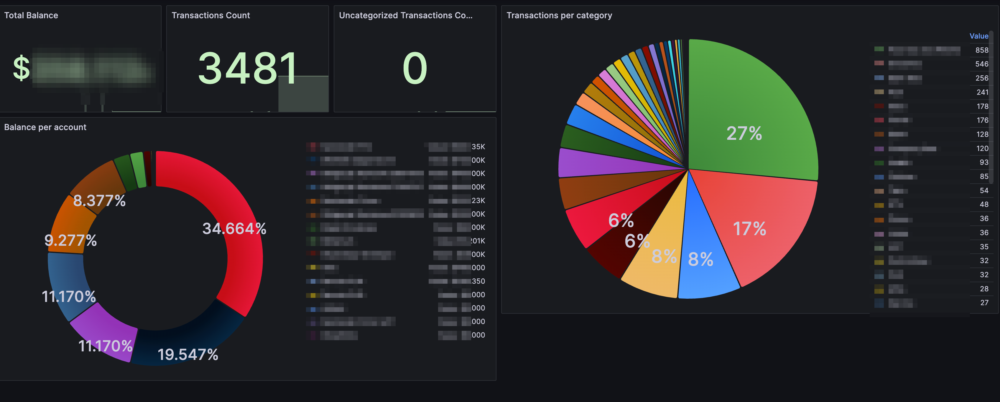

# Actual Budget Prometheus Exporter

<p>
    <a href="https://github.com/sakowicz/actual-budget-prometheus-exporter">
        
    </a>
    <a href="https://hub.docker.com/r/sakowicz/actual-budget-prometheus-exporter">
        
    </a>
    <a href="https://codecov.io/github/sakowicz/actual-budget-prometheus-exporter" >
        
    </a>
</p>

### Description

Simple Prometheus exporter for [Actual Budget](https://actualbudget.com/).

It exposes the following metrics:

```prometheus
actual_budget_account_balance{account="Account Name",is_off_budget="false"} 10000 # for each account
actual_budget_category_tranasction_count{category="Category Name"} 1000 # for each category
actual_budget_uncategorized_transaction_count 0
actual_budget_balance 1000000 # total balance
actual_budget_transaction_count 1000
actual_budget_transfers_count 100
```

### Grafana Dashboard

You can use the following Grafana dashboard to visualize the metrics exposed by the Actual Budget Prometheus Exporter:


[Actual Budget Grafana Dashboard](https://grafana.com/grafana/dashboards/22789-actual-budget/)

To import the dashboard, follow these steps:

1. Open your Grafana instance.
2. Go to the "Dashboards" section.
3. Click on "Import".
4. Enter the dashboard ID: `22789`.
5. Click "Load" and follow the instructions to complete the import.

### Configuration

```yaml
services:
  actual_server:
    image: docker.io/actualbudget/actual-server:latest
    ports:
      - '5006:5006'
    volumes:
      - ./actual-data:/data
    restart: unless-stopped

  actual-budget-prometheus-exporter:
    image: docker.io/sakowicz/actual-budget-prometheus-exporter:latest
    restart: unless-stopped
    ports:
      - '3001:3001'
    environment:
      ACTUAL_SERVER_URL: http://actual_server:5006
      ACTUAL_PASSWORD: your_actual_password
      ACTUAL_BUDGET_ID: your_actual_budget_id # This is the ID from Settings → Show advanced settings → Sync ID
#      ACTUAL_E2E_PASSWORD:  # optional. required if you have E2E encryption
```
